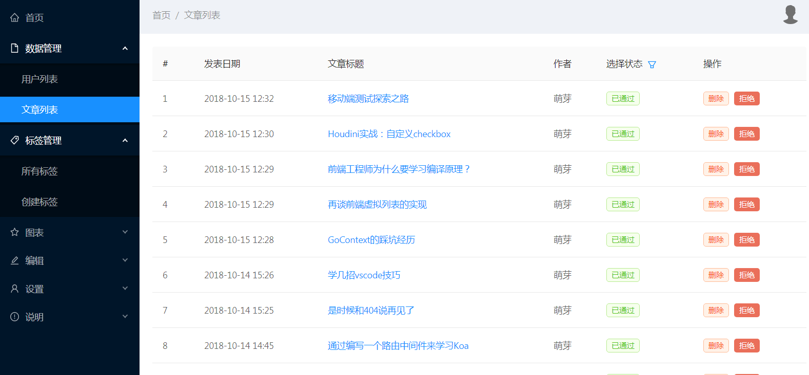

# manage
[mengya](https://github.com/manyuewuxin/mengya)后台管理系统项目

## 技术栈
react + react-router + antd + axios + chart

## 安装

    git clone https://github.com/manyuewuxin/manage.git
    cd manage
    npm install
    npm run build
    npm run dev 
    访问: http://localhost:3001

## 部分截图
